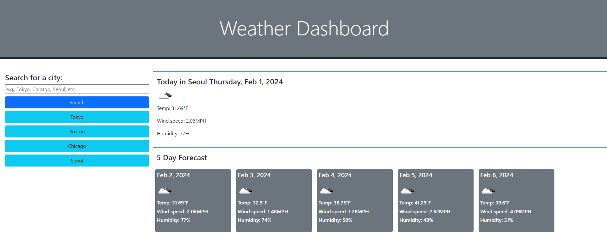

# Weather-Dashboard

## Description

A Weather Application to provide simple weather forecasts for user queried locations.

## Table of Contents

- [Introduction](#introduction)
- [Problem](#problem)
- [Solution](#solution)

## Introduction

The client travels frequently and would like to see weather in other locations.

## Problem

The client travels frequently and would like to see the weather for multiple cities to be able to plan their trip.

## Solution

I created a weather application that allows the user to query city names and see the forecast for that city. The queried names are saved to allow the user to revisit previous cities and view the weather.

[Link to the deployed application](https://ktetsuyama.github.io/Work-Day-Scheduler/)

## Credits

I also used phind.com to help debug my code.

Tutorials used:

[jQuery Docuementation](https://api.jquery.com/)

## License

MIT License
